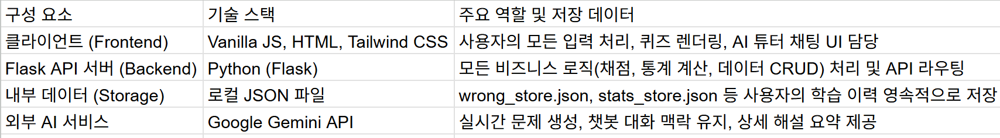

# 🎓 정보처리산업기사 스마트 학습 플랫폼 (정처산기)

## 🌟 프로젝트 개요

본 프로젝트는 정보처리산업기사/기사 실기 시험을 대비하는 수험생을 위해 개발된 **AI 기반의 분산형 학습 플랫폼**입니다. 핵심은 **AI 기반 문제 생성**, **과학적인 간격 반복 학습 시스템**, 그리고 **정교한 채점 로직**을 통해 학습 효율을 극대화하는 데 있습니다.

## 🛠️ 아키텍처 및 주요 기술 스택

| 분류 | 기술 | 설명 |
| :--- | :--- | :--- |
| **백엔드** | Python (Flask) | 가볍고 빠른 API 서버 구축 및 비즈니스 로직(채점, 통계) 처리 |
| **인텔리전스** | Google Gemini API | 이론 및 코드 문제 자동 생성, AI 튜터 챗봇 기능 구현 |
| **프론트엔드** | Vanilla JS, HTML, Tailwind CSS | 반응형 UI, 동적 퀴즈 렌더링, 사용자 경험(UX) 개선 |
| **데이터 관리** | 로컬 JSON 파일 | 오답, 통계, 북마크 등의 영속적인 데이터 관리 (Git에 커밋됨) |

## 🧠 핵심 기능 상세 작동 원리 (Code Flow Deep Dive)

### 1. 🎯 정교한 채점 및 학습 통계 통합

| 파일 | 엔드포인트/함수 | 상세 작동 원리 |
| :--- | :--- | :--- |
| `app/routes/quiz.py` | `/api/submit` (POST) | **정규화 채점 로직:** `normalize_text` 헬퍼 함수를 통해 사용자 입력과 정답에서 **모든 공백, 줄바꿈, 특수 기호(`,`, `[]`, `;`)를 제거**하고 비교합니다. 이로써 주관식 채점의 사소한 오차를 방지하여 정확도를 높입니다. |
| `app/data/stats_store.py`| `add_quiz_result` | 퀴즈 유형(`mock_exam`, `review` 등)에 따라 경험치(XP)에 **보너스 배율**을 적용하여 학습 결과를 차등 반영합니다. XP 누적량으로 7단계 레벨을 실시간 결정(`get_level_info`)합니다. |
| `app/data/category_analysis.py`| `update_category_stats` | 문제 텍스트 내 키워드를 분석하여 카테고리(운영체제, DB, 코딩 등)를 자동 분류합니다. 이 데이터를 바탕으로 카테고리별 정답률을 계산하여 사용자의 **취약 분야**를 명확히 분석합니다. |

### 2. 🔁 과학적인 간격 반복 학습 (Spaced Repetition)

| 파일 | 엔드포인트/함수 | 상세 작동 원리 |
| :--- | :--- | :--- |
| `app/data/wrong_store.py` | `calculate_next_review_date` | 오답 시 **1일 → 3일 → 7일 → 14일 → 30일** 간격으로 복습 주기를 점진적으로 늘려 다음 복습 날짜를 계산합니다. 이는 과학적 학습 이론에 기반하여 장기 기억 전환을 유도합니다. |
| `app/routes/quiz.py` | `/api/review` (GET) | `get_review_questions` 함수를 통해 **복습 기한이 도래한 문제를 최우선으로 선별**하여 퀴즈로 제공합니다. 복습할 문제가 없으면 전체 오답 목록에서 무작위로 추출합니다. |
| `app/data/wrong_store.py` | `remove_mastered_questions` | **5회 이상 연속 정답(Review Streak)** 시, 해당 문제를 오답 목록에서 자동으로 제거하여 학습의 최종 마스터링을 관리합니다. |

### 3. 🤖 AI 인텔리전스 활용

| 파일 | 엔드포인트/함수 | 상세 작동 원리 |
| :--- | :--- | :--- |
| `app/routes/quiz.py` | `/api/ai/chat` (POST) | AI 튜터 챗봇은 사용자 질문과 함께 **이전 대화 기록(`history`)**을 `contents` 배열에 담아 전송합니다. 이를 통해 Gemini 모델은 **맥락을 기억하고 이어서 답변**할 수 있는 대화형 기능을 구현합니다. |
| `app/data/question_generator.py`| `generate_code_questions` | Gemini API에 **엄격한 JSON 형식**을 요청하여, 프로그래밍 언어 및 카테고리에 맞는 출력 문제와 해설을 생성하고, 이를 문제 은행 파일에 **자동으로 추가**하여 확장성을 확보합니다. |
| `app/routes/quiz.py` | `/api/ai/explain` | **"가장 중요한 핵심만 1~2줄로 요약"** 해주는 맞춤형 시스템 프롬프트를 사용하여, 빠르고 효율적인 문제 해설을 제공합니다. |

### 4. 🌙 학습 UX/UI 개선 (Frontend - `static/app.js`)

| 기능 | 로직 | 장점 |
| :--- | :--- | :--- |
| **실전 모의고사** | `startMockExam` 함수에서 40문항, 40분 타이머를 설정하며, 시간 초과 시 `submitQuiz()`를 강제 호출합니다. | 실제 시험 환경을 시뮬레이션하여 시간 관리 능력을 향상시킵니다. |
| **동적 입력창** | 퀴즈 카드의 `<textarea>`에 `oninput` 이벤트를 바인딩하여, 내용 길이에 따라 **입력창 높이가 자동으로 조절**됩니다. | 주관식 장문 답변 작성 시 사용자 편의성이 극대화됩니다. |
| **AI 챗봇 입력** | `chatInput.addEventListener('keydown', ...)`에서 **Enter는 전송**, **Shift + Enter는 줄바꿈**으로 분리 처리하여 챗봇 사용성을 개선했습니다. | 직관적인 조작으로 편리하게 질문할 수 있습니다. |
| **진행률 표시** | `checkQuizProgress` 함수가 현재 입력된 텍스트의 유무를 실시간으로 확인하여 상단의 `top-progress-bar`에 반영합니다. | 사용자가 퀴즈 풀이 진척도를 시각적으로 명확하게 인지할 수 있도록 돕습니다. |

